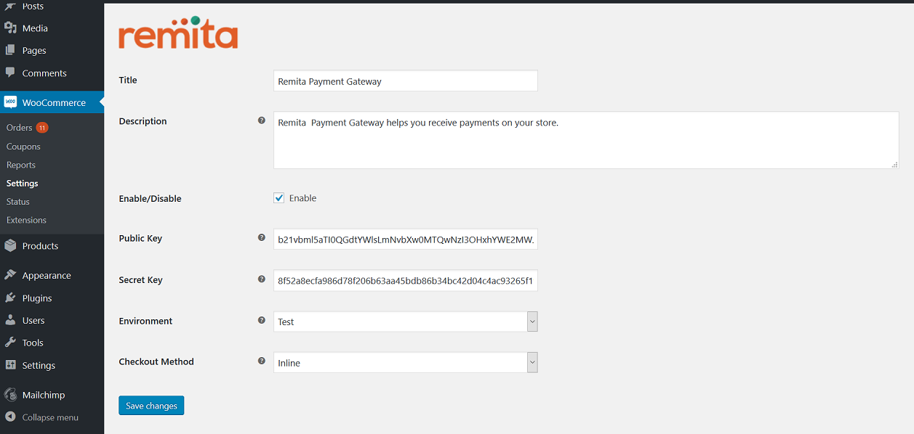

# Remita Woocommerce Payment Plugin

---
- [Summary](#summary)
- [Plugin Features](#Plugin Features)
- [Install](#Install)
- [Setup](#setup)

---
### Summary

With Remita Woocommerce Payment Plugin, the store admin can easily add all desired payment methods to the Woocommerce webshop. Please refer to https://www.remita.net for an overview of all features and services.

 

---

### Plugin Features

*   __Accept payment__ via Visa Cards, Mastercards, Verve Cards and eWallets

* 	__Seamless integration__ into the Woocommerce checkout page.
* 	__Add Naira__ currency symbol.

---

### Install

#### Automatic Installation

1. Login to your WordPress Admin area

2. Go to "Plugins > Add New" from the left hand men
3. In the search box type "Remita Woocommerce Payment Gateway"
4. From the search result you will see "Remita Woocommerce Payment Gateway" click on "Install Now" to install the plugin
5. A popup window will ask you to confirm your wish to install the Plugin

#### Note
If this is the first time you've installed a WordPress Plugin, you may need to enter the FTP login credential information. If you've installed a Plugin before, it will still have the login information. This information is available through your web server host.

* Click "Proceed" to continue the installation. The resulting installation screen will list the installation as successful or note any problems during the install.
* If successful, click "Activate Plugin" to activate it, or "Return to Plugin Installer" for further actions.

#### Manual Installation

1. Download the plugin zip file

2. Login to your WordPress Admin. Click on "Plugins > Add New" from the left hand menu
3. Click on the "Upload" option, then click "Choose File" to select the zip file from your computer. Once selected, press "OK" and press the "Install Now" button.
4. Activate the plugin

5. Open the settings page for WooCommerce and click the "Payment Gateways," tab
6. Click on the sub tab for "Remita Payment Gateway"
7. Configure your "Remita Payment Gateway" settings.

---

### Setup

To setup the plugin, go to __WooCommerce > Settings__�from the left hand menu, then click "Payment Gateways" from the top tab. You should see __"Remita Payment Gateway"__ as an option at the top of the screen. Click on it to configure the payment gateway.

* __Enable/Disable__ - check the box to enable Remita Payment Gateway.
* __Title__ - allows you to determine what your customers will see this payment option as on the checkout page.
* __Description__ - controls the message that appears under the payment fields on the checkout page. Here you can list the types of cards you accept.
* __Public Key__  - enter your Remita Public Key.
* __Secret Key__  - enter your Remita Secret Key.
* __Environment__  - Select Test or Live.
* Click on __Save Changes__ for the changes you made to be effected.

## Useful links
* Join our Slack Developer/Support channel at http://bit.ly/RemitaDevSlack
    
## Support
- For all other support needs, support@remita.net
- To contribute to this repo, create an issue on what you intend to fix or update, make a PR and team will look into it and merge.
